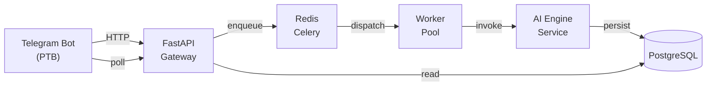

# ThreadMind


**Version: 1.0.0** | **Bot**: [@ThreadMindBot](https://t.me/ThreadMindBot) | Built by [@Groots23](https://t.me/Groots23)

ThreadMind is an AI-powered Telegram bot that summarizes channel discussion threads, highlights insights, detects owner vs members, and returns structured summaries.

See [CHANGELOG.md](CHANGELOG.md) for version history and roadmap.

## Goals
- Provide fast, structured summaries of Telegram threads.
- Enterprise-grade, horizontally scalable architecture.
- Pluggable AI providers with sensible fallbacks.

## Architecture



Layers are fully isolated:
- Bot layer is stateless.
- API Gateway handles validation, auth, rate-limit, job enqueue.
- Queue is Redis broker; workers process jobs.
- AI Engine is pluggable with OpenAI/Gemini and local fallback.
- PostgreSQL persists users and jobs.

## Repository Structure

```
/app
  /bot
    bot.py
    handlers.py
    webhook.py

  /gateway
    main.py
    routes.py
    validators.py
    schemas.py

  /queue
    celery_app.py
    tasks.py

  /workers
    threadmind_worker.py

  /ai_engine
    __init__.py
    provider_openai.py
    provider_gemini.py
    pipeline_summarizer.py
    highlight_detector.py
    formatter.py

  /db
    base.py
    models.py
    crud.py
    migrations/

  /utils
    logger.py
    config.py
    rate_limit.py
    telegram_parser.py

Dockerfile.api
Dockerfile.worker
docker-compose.yml
env.example
alembic.ini
README.md
requirements.txt
```

## Setup

1) Copy env vars
```
# Linux/macOS
cp env.example .env

# Windows (PowerShell)
copy env.example .env
```
Fill in TELEGRAM_BOT_TOKEN and any AI provider keys. For local development without Docker, set `API_GATEWAY_URL=http://localhost:8000`.

2) Run with Docker
```
docker compose up --build -d migrate
# Run core services
docker compose up --build -d api worker bot redis postgres
```

3) Scale workers
```
docker compose up -d --scale worker=10
```

4) API Docs
- Swagger: http://localhost:8000/docs
- Health: http://localhost:8000/healthz

## Development (without Docker)

Prereqs: Python 3.11, Postgres, Redis

```
python -m venv .venv
. .venv/bin/activate  # Windows: .venv\\Scripts\\activate
pip install -r requirements.txt

# Set env vars (see env.example)
# Run DB migrations
alembic -c alembic.ini upgrade head

# Run API
uvicorn app.gateway.main:app --reload

# Run Worker
celery -A app.queue.celery_app.celery worker -l info

# Run Bot
python -m app.bot.bot
```

## Environment Variables
See `env.example` for all required variables.

## Notes
- The Telegram thread fetch is mocked in `app/utils/telegram_parser.py::fetch_thread_messages`. Replace with real Telegram API access when needed.
- Providers auto-fallback in `app/ai_engine/__init__.py`.
- Rate limiting implemented with Redis in `app/utils/rate_limit.py`.
